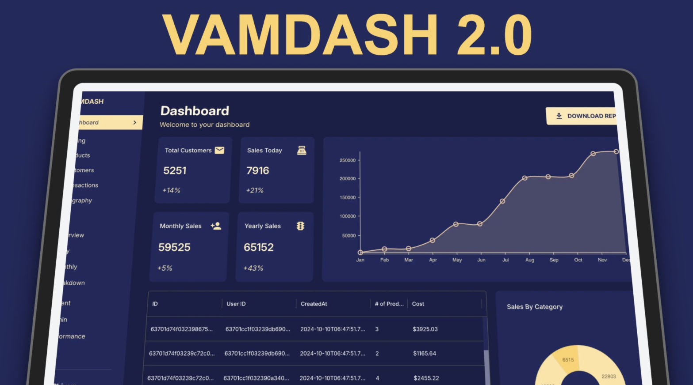

# 🌐 MERN Stack Dashboard (FrontEnd, Backend with Node and Mongo Db) 🚀

Welcome to the VamDash2.0, a full‑stack web application designed to visualize and manage data dynamically. Built with powerful modern technologies, this project focuses on seamless user experience, scalability, and performance optimization. ⚡

---

## 🖼️ Screenshot
Here’s a peek at the dashboard interface 👇  

---

## 🧩 Tech Stack

### 🎨 Frontend
- ⚛️ **React** — Dynamic, component-driven interface  
- 💨 **TailwindCSS** — Rapid, responsive design made simple  
- 🧱 **Material UI (MUI)** — Sleek, pre‑built components for professional styling  
- 🔁 **Redux Toolkit** — Effortless state management and clean asynchronous logic

### 🛠️ Backend
- 🌍 **Node.js + Express.js** — Robust and scalable RESTful backend  
- 🍃 **MongoDB** — NoSQL database for efficient data storage and aggregation  

---

## ✨ Features
- 📊 Interactive dashboard interface with dynamic data rendering  
- 🔄 Real‑time updates via efficient API calls  
- 🧭 Centralized state handling using Redux Toolkit  
- 🧩 Modular and reusable UI components  
- 🔐 Ready for future authentication and role‑based access  

---

## 💡 Highlights & Learnings
- Optimized full‑stack workflows between React and Express  
- Simplified data fetching using **custom Redux hooks**  
- Leveraged `createSlice` and `createAsyncThunk` for powerful async logic  
- Applied modern UI/UX design practices for intuitive navigation  

---

## 🧭 Roadmap
- 🧑‍💻 Add authentication & user sessions  
- 🔢 Integrate Chart.js or D3.js for analytics  
- 🌗 Introduce dark mode support  
- 🐳 Dockerize for scalable deployment  

---

## 🔗 Live Demo
Experience it here: [View Dashboard](https://redux-dash-1.onrender.com/)

---

## 🏷️ Tags
`#MERNStack` `#React` `#TailwindCSS` `#MaterialUI` `#MongoDB` `#ReduxToolkit` `#WebDevelopment`

---
